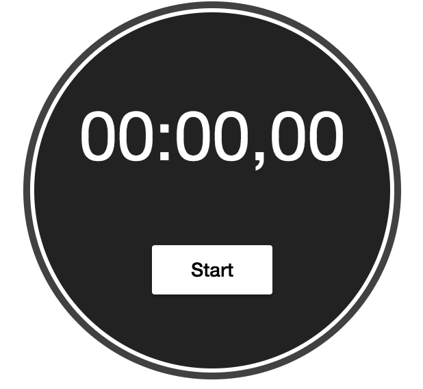

# TP 2
> Le composant Chronomètre

Nous allons dans ce TP créer un composant Chronomètre. Nous verrons ainsi comment créer un composant 
ainsi que la création d'un Pipe pour formater l'affiche du composant.

## Notre premier composant

Dans le dossier `src/app`, créer un dossier `chrono`. Ce dossier contiendra les fichiers `html`, `css` et `ts`.

Voici la sctructure cible du projet :

```
src/app
├── app.component.css
├── app.component.html
├── app.component.spec.ts
├── app.component.ts
├── app.module.ts
└── chrono
    ├── chrono.component.css
    ├── chrono.component.html
    └── chrono.component.ts

```

Vous devez donc créer les fichiers nécessaires au componsant Chrono !

Ensuite éditez le fichier `chrono.component.ts` et collez le contenu suivant :

```typescript
import { Component, OnInit } from '@angular/core';

@Component({
    selector: 'chrono',
    templateUrl: './chrono.component.html',
    styleUrls: ['./chrono.component.css']
})
export class ChronoComponent implements OnInit {
    
    constructor() {
        
    }
    
    ngOnInit() {
        
    }
}
```

Puis ajoutez le composant dans la liste des composants de `AppModule` comme suivant :


```typescript
@NgModule({
    declarations: [
        AppComponent,
        ChronoComponent // <- Ici
    ],
    ...
})
export class AppModule { }
```
> Vous devez systématiquement déclarer votre composant en tant que dépendence du module pour l'utiliser !


### Exercice 1 - Template

Commencez par créer le template HTML nécessaire à l'affichage des données du chronomètre telles que:

* Les millisecondes,
* Les secondes,
* Les minutes.

Et n'oubliez pas le bouton start/stop du chrono !

Voici un exemple de ce qui est attendu :

 

Vous pouvez utiliser `@angular/material` pour créer un bouton et votre composant comme suivant :

```html
<div>
    <span class="times">0</span>
    <button md-raised-button>Start</button>
</div>
```

Pour le css :

```css
:host {
    text-align: center;
    display: block;
    width: 200px;
    height: 200px;
    margin: auto;
    background: #222;
    padding: 30px;
    border-radius: 100%;
    position: relative;
    z-index: 0;
}
:host>div {
    position: relative;
    z-index: 3;
}
:host:after {
    content: ' ';
    position: absolute;
    width: 206px;
    height: 206px;
    border: 5px solid #414141;
    border-radius: 100%;
    top: -8px;
    left: -8px;
    padding: 30px;
    z-index: 0;
}
:host .times {
    display: block;
    font-size:50px;
    color:white;
    margin-bottom: 50px;
    padding-top: 30px;
}

:hover button {

}
```

> Note : le selecteur `:host` représente l'élément encapsulant votre composant Angular.


### Exercice 2 - Création de l'action click


À partir du cours, essayez de créer une action au click du bouton.


### Exercice 3

Maintenant que vous avez créé l'action au click du bouton, implémentez les méthodes `startTimer()` et `stopTimer()`.


## Notre premier Pipe

En l'état l'affichage des minutes, secondes et millisecondes n'est pas correct (cf. capture chrono).
 
Nous allons donc créer un Pipe, équivalent des filtres Angular 1, pour formatter les données.

```
src/app
├── app.component.css
├── app.component.html
├── app.component.spec.ts
├── app.component.ts
├── app.module.ts
├── chrono
│   ├── chrono.component.css
│   ├── chrono.component.html
│   ├── chrono.component.spec.ts
│   └── chrono.component.ts
└── dec-to-str.pipe.ts
```

Commencez par créer le fichier `dec-to-str.pipe.ts`. Créez la `classe DecToStrPipe` comme présenté dans le cours.

### Exercice

Le filtre doit transformer/formatter un entier vers un string sur deux chiffres !

> Correction du TP : #resources-tp2-solution

[Suivant](tp3-communication-entres-composants.md)

