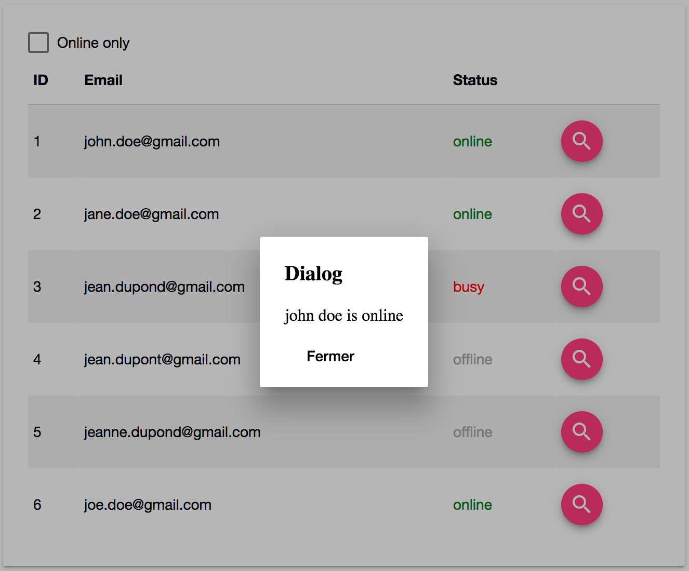

# TP 3
> Communication entres composants

Dans ce TP, nous allons créer un tableau contenant la liste des utilisateurs 
avec leur statut en ligne. 

Pour rappel, la structure initiale du projet est la suivante :

```bash
src/app
├── app.component.css
├── app.component.html
├── app.component.spec.ts
├── app.component.ts
└── app.module.ts
```

## Le service Users

Nous allons créer notre 1er service. Nous allons partir de principe que l'application va évoluer dans le temps et donc nos services
aussi. Par exemple, notre service `UsersService` va exposer un ensemble de méthode dont la liste des utilisateurs.
Généralement ces informations sont exposés par un web service. Dans l'immédiat nous n'en avons pas, mais nous ferons tout comme !

Nous allons donc créer deux classes, la première sera un `FakeUsersService` et la seconde sera un `UsersService` (notre cible).
Ces deux classes implémenterons l'interface `IUsersService` comme suivant :

```typescript
export const Status: {[K in string]: K} = {
    online: "online",
    offline: "offline",
    busy: "busy"
};

export type Status = keyof typeof Status;

export class UserCredential {
    email: string;
    password: string;
}

export class User extends UserCredential {
    id: number;
    firstName: string;
    lastName: string;
    status: Status;
}

export interface IUsersService {
    getUsers(): Promise<User[]>;
    create(user: User): Promise<User>;
    exists(email: string): Promise<boolean>;
    get(email: string): Promise<User>;
}
```

Commencez par créer le UsersService avec @angular/cli :

```bash
ng g service services/users
```

Ensuite, créez le fichier `users.interface.ts` ainsi que la fichier `users.fake.service.ts`.
Et enfin implémentez la méthode `getUsers()` (les autres méthodes seront développés plus tard).

La méthode `FakeUsersService.getUsers()` devra retourner les données suivantes :

```json
[
    {"id": 1, "email": "john.doe@gmail.com", "password": "12345", "status": "online"},
    {"id": 2, "email": "jane.doe@gmail.com", "password": "12345", "status": "online"},
    {"id": 3, "email": "jean.dupond@gmail.com", "password": "12345", "status": "busy"},
    {"id": 4, "email": "jean.dupont@gmail.com", "password": "12345", "status": "offline"},
    {"id": 5, "email": "jeanne.dupond@gmail.com", "password": "12345", "status": "offline"},
    {"id": 6, "email": "joe.doe@gmail.com", "password": "12345", "status": "online"}
]
```

Une fois votre service fake implémenté, n'oubliez pas de l'ajouter à la liste des providers de votre module. 

> Aidez-vous du cours pour savoir comment ajouter un service mocké dans un module Angular.

Pour terminer, appelez la méthode getUser() dans le composant AppComponent et vérifiez que cela fonctionne.

## Le composant tableau des utilisateurs

Nous allons maintenant créer un composant qui va afficher la liste des utilisateurs sous forme de tableau.
Commencez par créer le composant `UsersTable` avec la commande suivante :

```bash
ng g component user-table
```

Voici ce qui est attendu du composant, nous devons pouvoir l'utiliser de la façon suivante :

```html
<app-users-table [users]="users"></app-users-table>
```
### Exercice 1

Avec ce que vous avez vue en cours sur les données d'entrées d'un composant avec `@Input()`, essayez d'afficher la liste des utilisateurs 
au format json dans le contenu du composant UsersTable dans un premier temps.

### Exercice 2

Maintenant que vous avez les données construisez votre composant. Voici un exemple du tableau attendu :

 

La feuille de style pour vous aider :
```css
table {
    border-collapse: collapse;
    border-spacing: 0;
}

table {
    width: 100%;
    display: table;
}

thead {
    border-bottom: 1px solid #d0d0d0;
}

th {
    padding: 15px 5px;
    display: table-cell;
    text-align: left;
    vertical-align: middle;
    border-radius: 2px;
}
```

Vous devez donc compléter la feuille de style afin d'afficher :

* Les lignes pairs en fonds gris clair,
* Le texte `online` en vert,
* Le texte `offline` en gris clair,
* Le texte `busy` en rouge.

Ensuite utilisez les intructions vue en cours pour afficher la liste des utilisateurs dans votre tableau.

Enfin, ajoutez une checkbox (md-checkbox) permettant d'afficher soit les utilisateurs en ligne, 
soit tous les utilisateurs.


## Communication entres composants

Notre tableau affiche désormais les données. Nous allons maintenant utiliser l'annotation `@Output` pour émettre 
un événement lorsque l'utilisateur clique sur le bouton correspondant à la ligne de l'utilisateur.
Cet événement sera remonté vers le composant `AppComponent`.

Une fois l'information de l'utilisateur remonté dans `AppComponent`, vous devrez afficher les informations de l'utilisateur 
dans une boite de dialogue (soit via une alert ou en utilisant la librairie [Material design](https://material.angular.io/components/component/dialog)).

 


## Conclusion

Ce TP vous aura appris à :

* Utiliser les directives intégrées à Angular (*ngIf, *ngFor),
* Créer un service Angular mocké et l'injecter dans un composant,
* Créer des composants avec une relation parent-enfant,
* Créer et utiliser un template,
* Communiquer entres les composants.


> Correction du TP : #resources-tp3-solution


[Suivant](tp4-formulaires-routes.md)

