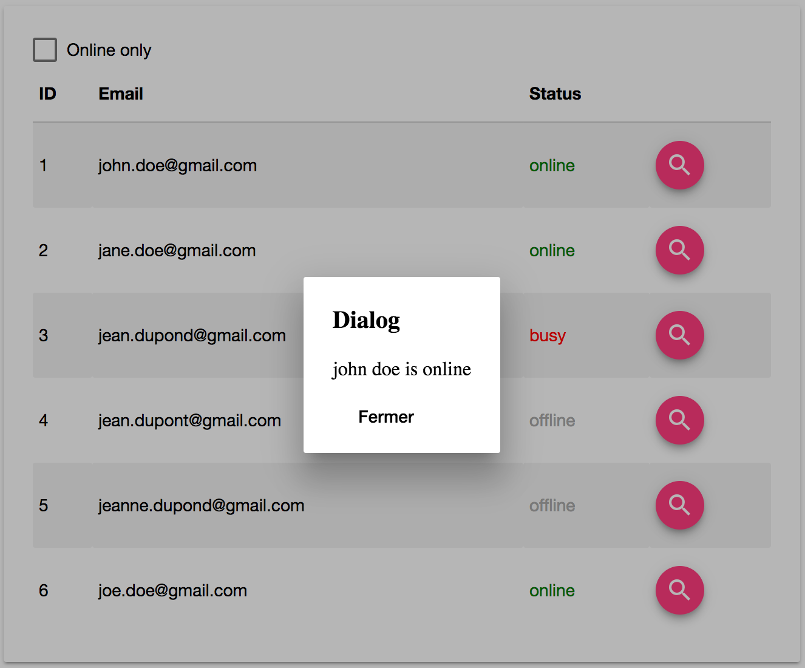

# TP 3
> Créer une liste d'utilisateurs en ligne

Dans ce TP, nous allons créer un tableau contenant la liste des utilisateurs 
avec leur statut en ligne. 

Pour rappel, la structure initiale du projet est la suivante :

```bash
src/app
├── app.component.css
├── app.component.html
├── app.component.spec.ts
├── app.component.ts
└── app.module.ts
```

## Notre 1er Service 

Dans le dossier `src/app`, créer votre 1er service sous le nom `UserService`.

Pour aller plus vite, vous pouvez utiliser l'outil `@angular/cli` pour créer votre service.

```bash
ng g service user
```

Genèrera les fichiers suivants :

```bash
src/app
├── user.service.spec.ts
└── user.service.ts
```

Ce service devra retourner la liste de tous les utilisateurs :

```json
[
    {"id": 1, "email": "john.doe@gmail.com", "status": "online"},
    {"id": 2, "email": "jane.doe@gmail.com", "status": "online"},
    {"id": 3, "email": "jean.dupond@gmail.com", "status": "busy"},
    {"id": 4, "email": "jean.dupont@gmail.com", "status": "offline"},
    {"id": 5, "email": "jeanne.dupond@gmail.com", "status": "offline"},
    {"id": 6, "email": "joe.doe@gmail.com", "status": "online"}
]
```

## Le composant tableau des utilisateurs

Dans le dossier `src/app`, créer un dossier `user-table` qui contiendra tout le code source du composant `UserTableComponent`.

Ce composant `UserTableComponent` affiche la liste des utilisateurs avec leur statut dans tableau HTML.

Pour aller plus vite, vous pouvez utiliser l'outil `@angular/cli` pour créer votre composant.

```bash
ng g component user-table
```

Ci-dessous le code source ajouté au projet :

```bash
src/app
└── user-table
    ├── user-table.component.css
    ├── user-table.component.html
    ├── user-table.component.spec.ts
    └── user-table.component.ts
```

Ajouter les feuilles de style à votre composant pour que :

* Les lignes pairs soient en fonds gris clair,
* Le texte `online` soit en vert,
* Le texte `offline` soit en gris clair,
* Le texte `busy` soit en rouge,
* L'entête du tableau soit en fonds bleu clair, avec le texte en blanc.

Le tableau possède une checkbox (md-checkbox) permettant d'afficher soit les utilisateurs en ligne, 
soit tous les utilisateurs.

## Composant enfant

Créer un composant `UserTableRowComponent` représentant une ligne du tableau.

Pour aller plus vite, vous pouvez utiliser l'outil `@angular/cli` pour créer votre composant.

```bash
ng g component user-table-row
```

Modifier votre code pour intégrer ce composant dans le composant `UserTableComponent`.

Ci-dessous le code source ajouté au projet :

```
src/app
└── user-table-row
    ├── user-table-row.component.css
    ├── user-table-row.component.html
    ├── user-table-row.component.spec.ts
    └── user-table-row.component.ts
```

Le `UserTableRowComponent` devra gérer l'afficher des données de l'utilisateur ainsi que l'action de s'afficher ou se masquer 
en fonction du statut d'affichage demandé par le composant parent.


## Communication entres composants

Notre tableau affiche désormais les données. Nous allons maintenant utiliser l'annotation `@Output` pour émettre 
un événement lorsque l'utilisateur clique sur le bouton correspondant à la ligne de l'utilisateur.
Cet événement sera remonté vers le composant `UserTableComponent` qui remontera cet événement vers le composant `AppComponent`.

Une fois l'information de l'utilisateur remonté dans `AppComponent`, vous devrez afficher les informations de l'utilisateur 
dans une boite de dialogue (soit via une alert ou en utilisant la librairie [Material design](https://material.angular.io/components/component/dialog)).

 


## Conclusion

Ce TP vous aura appris à :

* Utiliser les directives intégrées à Angular (*ngIf, *ngFor),
* Créer un service Angular et l'injecter dans un composant,
* Créer des composants avec une relation parent-enfant,
* Créer et utiliser un template,
* Communiquer entres les composants.


> Correction du TP : #resources-tp3-solution


[Suivant](tp4-formulaires-routes.md)

