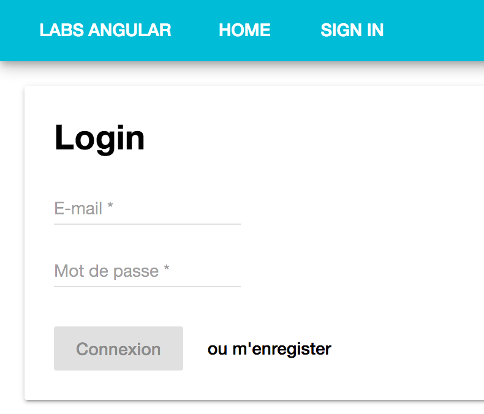

# TP 4
> Formulaires et routes

Dans ce TP, nous allons créer les formulaires de connexion et d'authentification.
Pour ce faire nous aurons besoin de mettre en place la module de routage d'Angular
pour afficher plusieurs pages.

## Installation

Installez le module `@angular/router` avec la commande suivante :

```bash
npm install -g @angular/router
```

## Création des pages et des routes

Nous devons maintenant créer les composants 
Déclarez ensuite les routes dans un nouveau fichier `app.routes.js`. Nous devrons créer les routes suivantes :

Page | Route | Composant | Description
---|---|---|---
Accueil | / | HomeComponent | Affiche un message de bienvenu avec un bouton rediregeant l'utilisateur vers la page de connexion. Une authentifié, cette page affiche la liste des utilisateurs. 
Login | /login | LoginComponent | Formulaire d'authentification
Signup | /signup | SigninComponent |Formulaire d'inscription

1. Commencez par créer les composants énoncés dans le tableau. 
2. Ensuite, vous devrez écrire vos routes dans le fichier `app.routes.js` en fonction de tableau ci-dessus.
3. Importez vos routes dans votre application `app.module.js`comme suivant :

```typescript
import { ROUTES } from "./app.routes";
import { RouterModule } from "@angular/router";

@NgModule({
    ...
    imports: [
        RouterModule.forRoot(ROUTES)
    ],
    ...
}
```

Enfin vous devez indiquer au routeur où seront afficher les vues dans votre application.

```html
<router-outlet></router-outlet>
```

### Page d'accueil

La page d'accueil devra afficher la liste des utilisateurs une fois authentifié.
Commencez par réintégrer la liste des utilisateurs dans HomeComponent. Nous nous occuperons des règles d'affichage plus tard.


### Page d'authentification

Nous allons maintenant utiliser les API Formulaires d'Angular. Nous utiliserons ici les `formulaires pilotés par le template`
mais vous êtes libre d'utiliser la seconde approche.

Le formulaire de connexion présentera les éléments suivants :

* Un champ e-mail, qui est un champ obligatoire et doit respecter le pattern e-mail,
* Un champ mot de passe, qui est un champ obligatoire,
* Un bouton de connexion, actif que si toutes les données saisies sont valides,
* Un bouton `ou m'enregister` pour rediriger l'utilisateur vers la page d'inscription.

N'oubliez pas d'afficher les messages en fonction du type d'erreur du champs associé.

Voici un exemple du formulaire attendu en Material :

 


### Le service Authenticate

Une fois le formulaire réalisé, vous devrez créer le service `AuthenticateService` (`ng g service authenticate`) qui aura pour fonction d'authentifier
l'utilisateur. 

Ce service exposera les méthodes suivantes :

Method | Descripton
---|---
`authenticate(email: string, password: string): boolean` | Permet d'authentifier l'utilisateur. Stocke l'utilisateur dans le localStorage et émet un événement sur le flux `onSignin`.
`logout()` | Supprimer les infos stocker dans le localStorage et émet un événement sur le flux onLogout.
`getUser()` | Retourne l'utilisateur connecté et stocké dans le localStorage.
`get onSignin(): EventEmitter<User>` | Retourne l'objet (ou flux) `EventEmmiter` dédié à l'événement onSignin.
`get onLogout(): EventEmitter<boolean>` | Retourne l'objet (ou flux) `EventEmmiter` dédié à l'événement onLogout.

> Nous utiliserons la class EventEmitter pour permettre à des composants de s'abonner à des événements.

### La page d'accueil (fin)

Maintenant que vous avez un service AuthenticateService de prêt, vous pouvez gérer les règles d'affichage de cette page !

### Page d'inscription

Le formulaire d'inscription présentera les éléments suivants :

* Prénom, qui est un champ obligatoire, 
* Nom, qui est un champ obligatoire, 
* Un champ e-mail, qui est un champ obligatoire et doit respecter le pattern e-mail,
* Un champ mot de passe, qui est un champ obligatoire,
* Un bouton de enregistrer, actif que si toutes les données saisies sont valides,

Ensuite rajouter les fonctions permettant d'ajouter un utilisateur dans liste d'utilisateurs du service `UserService`.

### La navbar (bonus)

Une application est toujours plus belle lorsque cette dernière possède une `navbar`.

Cette navbar devra s'afficher sur l'ensemble des pages. Elle devra afficher les liens suivants :

* Home,
* Signin lorsque aucun utilisateur n'est authentifié,
* Signout lorsqu'un utilisateur est authentifié.

> Correction du TP : #resources-tp4-solution

[Suivant](tp5-webservice.md)

